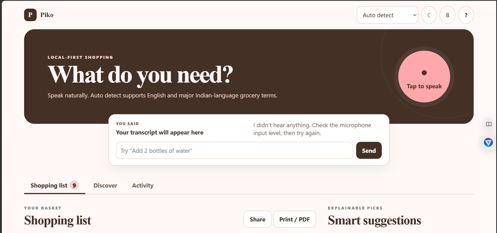
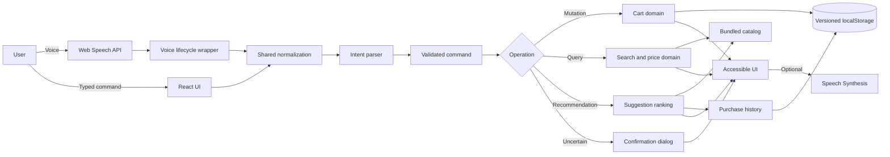
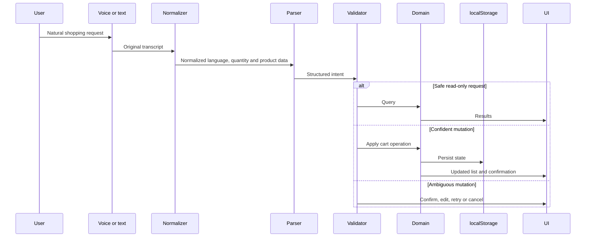
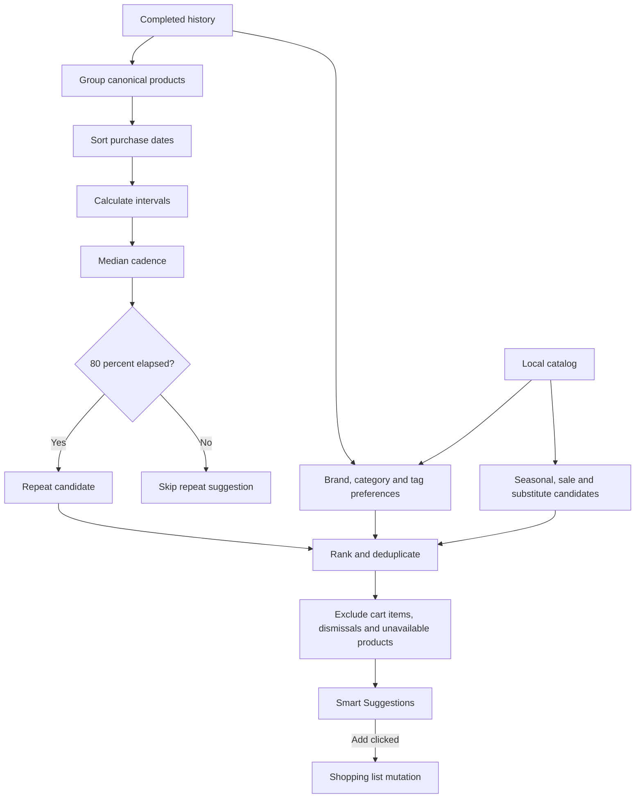

# Piko - Voice Command Shopping Assistant

[](https://github.com/Rhythm-Gandhi/unthinkable-VOICE-COMMAND/actions/workflows/deploy-pages.yml)
[](https://rhythm-gandhi.github.io/unthinkable-VOICE-COMMAND/)

Piko is a mobile-first, local-first shopping assistant that understands natural voice and typed grocery requests in English and major Indian languages. It manages quantities, prices, history, and explainable recommendations without a backend, account, database, API key, or external AI service.

**Live application:** [rhythm-gandhi.github.io/unthinkable-VOICE-COMMAND](https://rhythm-gandhi.github.io/unthinkable-VOICE-COMMAND/)

## Problem statement

Traditional shopping-list apps require repeated typing, exact product names, and manual quantity updates. This is inconvenient while cooking or multitasking and creates accessibility barriers for people who prefer speaking in English or Indian languages.

Piko lets users speak naturally:

- `I need half kilo atta.`
- `Do packet doodh chahiye.`
- `Remove two packets of milk.`
- `Milk kitna hai?`
- `Find toothpaste under Rs 100.`
- `Tell me my complete list.`

It normalizes the request, determines its intent, matches canonical products, validates uncertain mutations, and returns an accurate visual or spoken response.

## Approach

Voice and typed commands use the same deterministic TypeScript pipeline:

1. Preserve the original transcript.
2. Normalize punctuation, native digits, number words, fractions, units, currency, and multilingual aliases.
3. Classify the shopping intent.
4. Match canonical catalog products or preserve a safe custom product.
5. Validate the structured command and confidence.
6. Confirm uncertain cart mutations.
7. Execute the cart operation or read-only query.
8. Update totals, history, recommendations, undo state, and versioned browser storage.
9. Display and optionally speak the result.

Questions, searches, and recommendations never mutate the list automatically.

## Screenshots

### Main shopping interface



### Command guide and voice-output preference


## Features

### Natural voice and typed commands

- Native browser Web Speech API input
- Shared parser for voice and typed input
- Interim and final transcript handling
- Duplicate final-result protection
- Microphone permission, lifecycle, timeout, and error handling
- Typed fallback when recognition is unavailable
- Low-confidence Confirm, Edit, Retry, and Cancel flow
- Original transcript display with normalized internal execution
- Optional confirmations through the Speech Synthesis API

### Multilingual shopping

Piko includes grocery aliases, native digits, and number words for English, Hindi, Hinglish, Bengali, Marathi, Gujarati, Punjabi, Tamil, Telugu, Kannada, Malayalam, and Urdu.

Auto detect starts recognition with the browser or device locale and performs transcript-level language detection afterward. Manual locale selection is available when the speech engine needs a specific language.

### Supported intents

- Add one or multiple products
- Add more of an existing product
- Remove part or all of a product
- Set the final quantity
- Clear the complete list
- Query product quantity, complete list, total, or price
- Search and filter products
- Request recommendations, alternatives, or comparisons
- Choose a recommendation
- Navigate sections, undo, and share
- Safely reject unknown or ambiguous input

### Quantity and unit understanding

Piko stores product names, quantities, and units separately. Supported examples include:

- `250 g`, `500 grams`, `1/2 kg`, `½ kg`
- `half kilo`, `1.5 kg`, `one point five kg`
- `one and a half kilos`, `aadha kilo`, `dedh kilo`
- `litre`, `liter`, `ml`
- `piece`, `packet`, `bottle`, `box`, `can`
- `half dozen`, `1 dozen`, `jar`, `bunch`, `tub`

Compatible measurements merge correctly. For example, `250 g almonds` followed by `0.5 kg almonds` becomes one `750 g` entry. Malformed names such as `1k ata`, `one kilo flour`, or `2 packet milk` are not created.

### Canonical product matching

| Input aliases | Canonical product |
| --- | --- |
| milk, doodh, dudh, दूध | Milk |
| atta, aata, flour, आटा | Atta / Whole Wheat Flour |
| maida, plain flour, all-purpose flour | Maida |
| besan, gram flour, chickpea flour | Besan |
| sugar, shakkar, cheeni, चीनी | Sugar |
| onion, pyaaz, pyaz, प्याज | Onion |
| coriander, dhaniya, धनिया | Coriander |

Fresh coriander is categorized as **Produce**; coriander seeds and powder are categorized as **Spices**.

### Shopping-list management

- Categorized products and compatible duplicate merging
- Quantity steppers and inline editing
- Partial, complete, and set-quantity operations
- Complete-list clearing with confirmation
- Estimated item subtotals, discounts, savings, and cart total
- Purchase completion, history, recent activity, and undo
- Versioned `localStorage` persistence and safe legacy migration

### Pricing, search, and discovery

- Bundled sample Indian grocery catalog
- Integer-paise calculations internally
- Package and unit price conversion
- Quantity-based subtotals
- Catalog-derived estimates for custom products
- Product, brand, size, attribute, stock, and price filtering
- INR normalization for `₹`, `Rs`, `Rs.`, `INR`, `rupee`, and `rupaye`
- Price ranges, cheapest-option ranking, and nearby alternatives
- Local lazy-loaded WebP photographs with accessible fallbacks

Catalog prices and availability are illustrative estimates, not live retailer data.

### Intelligent Smart Suggestions

Piko ranks explainable suggestions using completed purchase frequency, median purchase cadence, overdue ratio, repeated brands/categories/tags, previous dismissals, cart contents, availability, substitutes, estimated price, sales, and seasonality.

For each canonical history product, Piko sorts `purchasedAt` timestamps, calculates the intervals, and uses the median cadence. A repeat suggestion may appear after roughly 80% of that cadence has elapsed.

Piko avoids claiming that it knows actual consumption:

> Purchased 4 times. You usually buy this every 8 days; the last purchase was 7 days ago.

Suggestions:

- Never add automatically
- Exclude cart items and dismissed suggestions
- Avoid duplicate catalog variants
- Replace unavailable products with an available substitute
- Preserve custom product quantity, unit, category, and estimated price
- Show a photograph or fallback, brand, size, price, discount, reason, Add, and Dismiss controls

### Accessibility, themes, and onboarding

- Responsive layout from 320 px upward
- Shopping List before Smart Suggestions on mobile
- Semantic navigation, forms, dialogs, and headings
- Keyboard access, visible focus, live regions, and reduced-motion support
- Persisted light and dark themes
- Refresh-time guide for language, theme, PNG export, voice output, and command help
- Speaker and mute icon synchronized with spoken confirmations

### Sharing and export

- Native Web Share API with clipboard fallback
- PNG export through the Canvas API
- Print and PDF output

## Architecture

### High-level modules



### Command-processing flow



### Recommendation flow



## Tech stack

| Technology | Purpose |
| --- | --- |
| React | Component-based user interface |
| TypeScript | Strict domain models and command validation |
| Vite | Development server and production bundling |
| CSS | Responsive layout, themes, print styles, and accessibility |
| Web Speech API | Browser-native speech recognition |
| Speech Synthesis API | Optional spoken confirmations |
| localStorage | Local list, history, dismissals, and settings |
| Canvas API | PNG shopping-list export |
| Web Share API | Native sharing with clipboard fallback |
| Vitest | Unit and regression tests |
| ESLint | Static code-quality checks |
| GitHub Actions | Automated verification and deployment |
| GitHub Pages | HTTPS static hosting |

## Project structure

```text
.
├── .github/workflows/deploy-pages.yml
├── docs/screenshots/
│   ├── piko-home.png
│   └── piko-command-guide.png
├── src/
│   ├── assets/
│   ├── App.tsx
│   ├── data.ts
│   ├── domain.ts
│   ├── domain.test.ts
│   ├── styles.css
│   ├── types.ts
│   ├── ui.test.ts
│   ├── voice.ts
│   └── voice.test.ts
├── package.json
├── vite.config.ts
└── README.md
```

| Module | Responsibility |
| --- | --- |
| `App.tsx` | UI, actions, dialogs, exports, and browser integration |
| `voice.ts` | Speech lifecycle, events, errors, and duplicate protection |
| `domain.ts` | Normalization, parsing, pricing, cart operations, recommendations, and persistence |
| `data.ts` | Bundled grocery catalog and metadata |
| `types.ts` | Shared TypeScript models |
| `styles.css` | Themes, responsive layouts, accessibility, and print styles |

## Example commands

```text
Add half kilo almonds.
Buy five pieces of oranges.
Do packet doodh chahiye.
Remove two packets of milk.
Milk ke do packet kam kar do.
I only need three milk packets.
दूध कितना है?
Tell me my entire list.
Find toothpaste under Rs 100.
₹50 se ₹100 ke beech toothpaste dikhao.
What is the cost of toothbrush?
Find me dhaniya.
Recommend fruits under ₹200.
Suggest an alternative to milk.
Add the first one.
Clear my list.
Undo.
```

## Local setup

### Requirements

- Node.js 22 or later
- npm
- Chrome or Edge recommended for speech recognition

### Install and run

```bash
git clone https://github.com/Rhythm-Gandhi/unthinkable-VOICE-COMMAND.git
cd unthinkable-VOICE-COMMAND
npm install
npm run dev
```

Open the URL printed by Vite. Microphone access requires `localhost` or HTTPS.

### Verification

```bash
npm test
npm run lint
npm run typecheck
npm run build
```

| Command | Purpose |
| --- | --- |
| `npm run dev` | Start the development server |
| `npm test` | Run Vitest once |
| `npm run lint` | Run ESLint |
| `npm run typecheck` | Run the TypeScript compiler |
| `npm run build` | Type-check and build production assets |

The current verified project contains **331 automated tests**.

## Deployment

Piko is hosted at:

**https://rhythm-gandhi.github.io/unthinkable-VOICE-COMMAND/**

Pushes to `main` trigger `.github/workflows/deploy-pages.yml`:


The workflow uses Node.js 22 and the official GitHub Pages actions. Vite uses:

```ts
base: "/unthinkable-VOICE-COMMAND/"
```

`dist/` is generated during deployment and is not committed. No deployment secret or environment file is required.

## Browser compatibility and privacy

| Browser | Typed commands | Voice recognition |
| --- | --- | --- |
| Chrome | Supported | Recommended |
| Edge | Supported | Recommended |
| Safari | Supported | Platform dependent |
| Firefox | Supported | Limited or unavailable |

Piko stores lists, completed history, dismissals, settings, and recent activity in the current browser. It does not store audio. The browser vendor may process speech according to its speech-service policy.

## Known limitations

- Prices, sales, stock, and seasonality are bundled estimates rather than live data.
- The local catalog is intentionally compact.
- Speech quality depends on the browser, operating system, microphone, network, and speech provider.
- Auto detect cannot guarantee the spoken language before transcription.
- Unusual phrasing may require confirmation or editing.
- Recommendations estimate purchase cadence but cannot measure actual consumption.
- Browser data does not automatically synchronize across devices.

## License and usage

This project was created as a technical assessment and educational demonstration. Product names, brands, prices, discounts, availability, and seasonal information are illustrative. Check the repository license before redistributing or using the project commercially.
